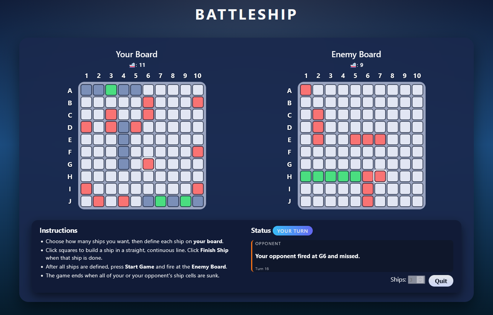

# 🚢 Battleship

Battleship game built with **Vanilla JavaScript + SCSS**.

Face off against the computer as you place ships, take shots, and try to sink your opponent’s fleet before they sink yours.

Originally built during week 4 of my software development course at \_nology (but refined later on!)

Responsive on **Desktop and Mobile**.



## 🕹️ Gameplay

- Choose how many **ships** you want to use (between **1 and 8**)
- Place your ships on **Your Board**:
  - Click squares to select cells for the current ship
  - Ships must:
    - Be at least **2 cells long**
    - Be in a **straight line** (horizontal or vertical)
    - Be **continuous** (no gaps)
  - Press **Finish Ship** when you’re happy with the selection
  - Repeat until all ships are defined
- Press **Start Game** to begin the battle
- Take turns with the computer:
  - Click a cell on the **Enemy Board** to fire a shot
  - Hits and misses are coloured differently and your **last move** is highlighted
  - The computer then fires back at your board (never guessing the same cell twice)
- The game ends when **all ship cells** of either player have been sunk

## 🧠 How the Opponent Works

When the game starts, the enemy fleet is generated with the **same ship lengths** as yours.

**Enemy ships are placed randomly** on a 10×10 board with the following limitations applied:

- Horizontal OR vertical.
- Continuous (no gaps).
- No overlapping cells.

On its turn, the computer:

1. Picks a random cell on your board it **hasn't guessed before**.
2. Marks it as a **Hit** or **Miss**.
3. Updates its internal record of which ship cells have been hit.

After every move, the game checks whether **all ships in a fleet are sunk**.

## 📂 Project Structure

```txt
BATTLESHIP/
├─ .github/
│  └─ workflows/
│     └─ deploy.yml         # GitHub Pages deployment workflow
├─ assets/
│  └─ images/
│     └─ readme_head.png    # Picture for readme
├─ js/
│  ├─ constants.js          # Shared constants (board size, letters, think delay)
│  ├─ state.js              # Central game state (boards, fleets, shots, phase)
│  ├─ dom.js                # All DOM element lookups (grids, buttons, log, etc.)
│  ├─ helpers.js            # Utility functions:
│  │                        #  - ID/coord conversions
│  │                        #  - Ship creation
│  │                        #  - "all ships sunk" checks
│  ├─ setup.js              # Grid construction + initial UI setup:
│  │                        #  - Builds the 10×10 boards
│  │                        #  - Reads initial ship count
│  │                        #  - Instructions panel toggle
│  ├─ gameplay.js           # Core game logic:
│  │                        #  - Player ship placement validation
│  │                        #  - Finish ship / ship continuity rules
│  │                        #  - Start game & opponent ship placement
│  │                        #  - Player shots & enemy shots
│  │                        #  - Fleet-size changes (with safeguards)
│  ├─ ui.js                 # UI updates:
│  │                        #  - Ship counters
│  │                        #  - Turn indicator
│  │                        #  - Battle log entries
│  │                        #  - Game over handling
│  ├─ main.js               # Entry point:
│                           #  - Builds grids
│                           #  - Wires up event listeners
│                           #  - Kicks off initial UI state
├─ index.html               # Main HTML shell
├─ styles.scss              # Main SCSS source
├─ styles.css               # Compiled CSS
├─ styles.css.map
└─ readme.md                # You're reading this!
```

## Tech Stack

- HTML 5
- CSS 3 / SCSS
- JavaScript (ES6)
- GitHub Pages (for deployment)

## Development

This is a static site; you can run it with any simple HTTP server in VS Code.

Note that any changes to `styles.scss` will have to be recompiled into CSS.
